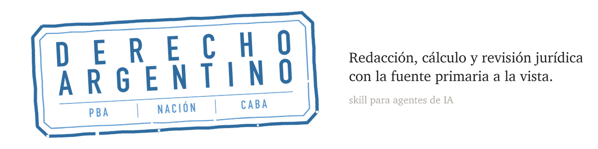

<p align="center">
  <picture>
    <source media="(prefers-color-scheme: dark)" srcset="assets/marca/banner-oscuro.png">
    
  </picture>
</p>

# Derecho argentino · skill para agentes de IA

<p align="center">
  <a href="CHANGELOG.md"></a>
  <a href="LICENCIAS.md"></a>
  
  
</p>

Skill de análisis, redacción y revisión jurídica bajo **derecho argentino**, con una capa offline
de fuente primaria y calculadoras deterministas. Trabaja tanto **desde una parte** como **desde el
órgano jurisdiccional**.

> [!NOTE]
> **Está en desarrollo temprano.** Lo que hay son **30 módulos**, y cada uno lleva su propia
> **fecha de verificación contra fuente primaria**. Donde todavía no hay módulo auditado, la skill
> abre el material heredado del repositorio y **avisa cada vez que ese material no pasó
> auditoría** — no lo presenta como verificado. La cobertura crece módulo por módulo; lo que no
> cambia es la regla de decir de dónde sale cada cosa.

[Instalar](#-instalar) · [Armar el proyecto](#-armar-el-proyecto) · [Usar](#-usar) ·
[Comandos](#comandos) · [Contar cómo te fue](#-contar-cómo-te-fue) ·
[Cómo está armado](docs/ARQUITECTURA.md) · [Desarrollar](docs/DESARROLLO.md)


## 📥 Instalar

**Funciona en las dos apps de escritorio —Claude y Codex (ChatGPT)— y en las dos consolas**, en Windows,
Linux y macOS. Elegí la que uses: todos los caminos llevan al mismo lugar y no hace falta hacer
más de uno.

**Lo único que hay que tener instalado aparte es Python 3.** Nada más: los scripts de la skill
usan sólo biblioteca estándar. Para saber si ya lo tenés, abrí una terminal y escribí
`python3 --version` —en Windows, `python --version`—. Si responde un número, está.

> [!IMPORTANT]
> **La descarga son unos 70 MB** y son casi todo normas y fallos, para que la skill pueda
> trabajar sin conexión. Tarda un rato la primera vez y no hay que volver a hacerlo.

### Desde la app de escritorio

Es el camino sin consola: se instala por menú. En las dos apps se pega el mismo repositorio, que
es este:

```
ciri-cuervo/derecho-argentino
```

####  En la app de Claude

**1 · Instalá la app.** Bajá la [app de escritorio](https://claude.com/download), instalala y
abrila. La primera vez pide iniciar sesión.

**2 · Agregá el marketplace.** En la barra lateral, **Personalizar** → pestaña **Plugins** →
botón **Agregar** → *Agregar marketplace* → *Agregar desde un repositorio*, y pegá el
repositorio de arriba.

**3 · Instalá el plugin.** En la lista aparece **Derecho argentino**, bajo *Nuevo*. Click en el
**+** de su tarjeta. Cuando el `+` se convierte en un tilde, quedó instalado.

Queda disponible en las dos pestañas de la app, **Chat** y **Cowork**.

#### <picture><source media="(prefers-color-scheme: dark)" srcset="assets/logos/codex-oscuro.svg"></picture> En la app de Codex / ChatGPT

**1 · Instalá la app de Codex / ChatGPT** siguiendo las instrucciones de OpenAI para tu sistema.

**2 · Agregá el marketplace.** En **Complementos** → botón **Agregar** → *Agregar marketplace*.
En *Origen*, el repositorio de arriba; en *Referencia de Git*, `main`; *Rutas dispersas* se deja
vacío.

**3 · Instalá el plugin.** Este es el paso que no se adivina: el plugin **no aparece en la
pestaña *Público*** junto a los conectores conocidos. Está en la pestaña **Personal**, bajo el
título *Derecho argentino*. Click en el **+** de la fila `derecho`.

Por cualquiera de los dos caminos queda disponible como **`derecho:derecho-argentino`** y se
activa sola ante una consulta jurídica argentina.

### Desde la terminal

Si ya vivís en la consola, hay dos caminos más —**Claude Code** por marketplace y **Codex a
mano**—, con los comandos para macOS, Linux y Windows:

**→ [Instalar desde la terminal](docs/TERMINAL.md)**

### Comprobar que quedó bien

En las apps de escritorio, la de Claude y la de Codex (ChatGPT), pedíselo en castellano: *"corré
el estado de la skill de derecho argentino"*. En Claude Code, `/derecho:estado`. En los dos casos
informa si encontró el repositorio y por qué camino, qué datos tiene cargados, cuántos días
pasaron desde la última verificación contra fuente primaria y si los tests pasan.

> [!IMPORTANT]
> **Los datos vienen con fecha de corte: el 14/09/2026.** Normas, fallos y series quedaron como
> estaban ese día, y el repositorio no se actualiza solo. Si lo instalás más adelante, el valor
> del jus, el IPC, el RIPTE, el CER y los días inhábiles ya quedaron atrás, y de esos números
> salen las liquidaciones y los vencimientos. **El primer día, pedile que actualice**: en Claude
> Code, `/derecho:estado` y después `/derecho:actualizar`; en las apps de escritorio, *"actualizá
> las series y las fuentes"*. Algunas fuentes oficiales rechazan a los agentes, así que esos
> descargadores se corren desde tu terminal — la skill te dice cuáles y te pasa el comando.


## 🗂️ Armar el proyecto

Un **proyecto** es una carpeta de trabajo con instrucciones propias: sirve para que el agente
sepa de entrada cómo trabajás, sin que se lo expliques en cada conversación. **No es
obligatorio** —la skill funciona igual sin él— pero si vas a usarla seguido, ahorra una vuelta.

**Cómo se crea.** En la **app de Claude**, "Nuevo proyecto" en la barra lateral: trae sus
propios campos de nombre, descripción e instrucciones. En **Claude Code** desde la terminal,
alcanza con abrir Claude parado en una carpeta y poner las instrucciones en un archivo
`CLAUDE.md` adentro. En **Codex (ChatGPT)**, lo mismo con un archivo `AGENTS.md`. En todos los
casos el contenido es texto común y es lo que sigue.

**Nombre.** Algo que distinga la cartera, no la herramienta. *Estudio · laboral y civil*,
*Juzgado Civil y Comercial 5*, *Consultas de familia*.

**Descripción** (opcional). Una línea sobre qué entra ahí. Sirve para acordarte dentro de seis
meses por qué lo creaste.

**Instrucciones.** Es lo único que cambia de verdad el resultado. **No repitas lo que la skill ya
sabe** —el derecho aplicable, los plazos, las fórmulas—: poné lo que la skill **no puede
adivinar** de vos. Cuatro cosas alcanzan:

```
Desde dónde consulto: abogado de parte, habitualmente por el trabajador.
Fueros y jurisdicción: laboral y civil, Provincia de Buenos Aires, Departamento
Judicial de La Plata; ocasionalmente fuero laboral nacional.
Dónde está el repositorio: /Users/nombre/derecho-argentino  (solo si lo clonaste)
Cómo quiero las respuestas: al grano, sin resúmenes de lo que ya dije.
```

**Las dos primeras son las que más rinden**, porque son exactamente lo que la skill pregunta al
abrir cada conversación: desde dónde consultás y en qué fuero. Con eso escrito, deja de
preguntarlo.

> [!NOTE]
> **Si no ponés instrucciones, no se rompe nada: la skill pregunta.** En el primer turno, antes de
> analizar, pide el rol y el fuero, y si hace falta el repositorio. Y si no querés contestar,
> trabaja igual **en modo neutro** y lo dice: expone el derecho aplicable y las posiciones en
> juego, sin construir estrategia para ninguna parte ni controlar de oficio nada.

**Lo que NO conviene poner.** Datos de expedientes reales en las instrucciones del proyecto: van
en la conversación, donde corresponden. Y ninguna instrucción que le pida dar por buenos montos,
plazos o fallos sin verificarlos — es justo lo que la skill está hecha para no hacer.


## 💬 Usar

No hay sintaxis que aprender: se describe el caso con los datos que haya.

```
Liquidación por despido sin causa: ingresó el 3/3/2019, despido el 10/8/2026,
mejor remuneración $1.450.000, no le pagaron nada. Trabajaba en La Plata.
```

```
Me notificaron la demanda el viernes 11/9. ¿Cuándo vence para contestar en PBA?
```

Va a preguntar lo que falte —si sos la parte o el juzgado, qué fuero, qué fecha— porque de eso
depende la respuesta, y va a decir de dónde saca cada norma que cita. Cuando un dato no lo puede
verificar, lo deja marcado en vez de completarlo por su cuenta.

> [!WARNING]
> **Esto es trabajo profesional.** La herramienta ayuda a redactar y calcular; no reemplaza el
> criterio de quien firma. Lo que salga con un marcador `[VERIFICAR ...]` está avisando que ese
> dato todavía no está confirmado: se resuelve antes de presentar.

### Comandos

Si preferís ir directo al cálculo hay ocho, aunque todo se alcanza igual preguntando en lenguaje
natural.

> [!NOTE]
> **Los comandos que empiezan con `/` son de Claude Code, la consola.** En las apps de
> escritorio —Chat o Cowork en la de Claude, y la de Codex (ChatGPT)— la skill funciona igual, pero
> se le pide en castellano: en vez de `/derecho:liquidacion`, *"liquidame este despido"*; en vez de
> `/derecho:plazo`, *"calculame el vencimiento"*.
> **No se pierde nada**: los comandos son atajos a lo mismo que la skill hace
> cuando se lo pedís con palabras.

| Comando | Qué hace |
|---|---|
| `/derecho:estado` | Diagnóstico: repo, perfil, datos cargados, qué quedó vencido y cómo arreglarlo |
| `/derecho:verificar` | Vuelve a pedir cada norma del manifiesto y avisa si alguna cambió en la fuente oficial |
| `/derecho:actualizar` | Baja normas, fallos y series de índices que falten |
| `/derecho:liquidacion` | Liquidación por extinción del contrato de trabajo |
| `/derecho:plazo` | Cómputo de un plazo, con ferias, feriados trasladables y gracia |
| `/derecho:intereses` | Actualización e intereses sobre un crédito |
| `/derecho:honorarios` | Honorarios y aportes en PBA (Ley 14.967) |
| `/derecho:configurar` | Entrevista corta: guarda cómo trabajás para que la skill ordene sus preguntas |

Los cuatro de cálculo **no son atajos al script**: identifican primero qué régimen rige, piden los
datos que faltan y recién después calculan.


## 🔍 Qué hace distinto

**No inventa.** Ninguna cita de fallo sin carátula, causa y fecha verificadas. Ningún monto de
memoria. Cuando falta un dato sale un **marcador canónico** que dice exactamente qué falta para
resolverlo, en vez de una estimación plausible.

**Pregunta antes de asumir.** No hay rol por defecto —puede estar preguntando un abogado de parte,
un juez, un empleado de un tribunal— ni régimen por defecto: en el fuero laboral bonaerense
conviven la Ley 11.653 y la Ley 15.057 según la fecha de la audiencia de vista, y la skill
pregunta esa fecha antes de citar un código procesal.

**Fuente primaria offline.** `argentina/fuentes/` guarda el texto consolidado de **110 normas** y
**64 fallos**, cada uno con su URL, su fecha de descarga y su hash SHA-256. `verificar_normas.py`
vuelve a pedirlos y sale con código 1 si alguno cambió: es una alarma de reforma legislativa, no
un backup.

**Aritmética con scripts, no a ojo.** Liquidación por extinción, cómputo de plazos hábiles con
ferias y feriados trasladables, intereses, honorarios y aportes en PBA. Los scripts **no traen
montos**: piden el tope del art. 245, el valor del jus o el índice, y antes que inventar un número
salen con código 2.


## ⚠️ Advertencias

**No reemplaza el criterio profesional.** Es un asistente que verifica, ordena y marca lo que
falta; la responsabilidad por lo que se presenta es de quien firma.

**Los perfiles de área** (`*-CLAUDE.md`) y los **modelos de escritos** se consolidaron en 2026 y
**no pasaron la auditoría contra fuente primaria** que sí pasaron los módulos de `references/`. La
precedencia ante conflicto es: fuente primaria → la skill y sus módulos → docs del Project →
perfiles del repo.

**Un cálculo con una serie vencida da un número plausible y equivocado**, que es justo lo que esta
herramienta existe para evitar. `/derecho:estado` avisa qué quedó atrás y `/derecho:actualizar` lo
trae de la fuente oficial. `/derecho:verificar` es lo otro, y es distinto: vuelve a pedir cada
norma del manifiesto y compara el hash, para detectar una reforma legislativa.

**El repositorio es público y es solo base de conocimiento.**
`argentina/fuentes/_local/` está en `.gitignore`: es donde el abogado deja ejemplares de obras
comerciales con derechos reservados. No commitear nada de ahí, ni piezas, liquidaciones o datos de
expedientes.


## 🗣️ Contar cómo te fue

**El uso real es lo que más falta.** El repositorio tiene tests, verificación contra fuente
primaria y guardarraíles, y ninguna de esas cosas dice si la skill sirve en una cartera de verdad.
Eso sólo lo sabe quien la usa.

| Qué querés hacer | Dónde |
|---|---|
| **Contar cómo te fue**, para qué la usaste, qué te resultó y qué no | [Discusiones · Experiencias](../../discussions) |
| **Preguntar** cómo se hace algo, o por qué la skill contestó lo que contestó | [Discusiones · Preguntas](../../discussions) |
| **Proponer** un fuero, un instituto o un cálculo que falte | [Discusiones · Ideas](../../discussions) |
| **Reportar un error de derecho** —una norma vencida, un fallo mal citado, un plazo equivocado— | [Issues](../../issues) |
| Algo que preferís no publicar | Ver [`SECURITY.md`](SECURITY.md) |

> [!IMPORTANT]
> **Nunca pegues datos de un expediente real** — ni carátulas, ni partes, ni montos, ni piezas.
> Esto es público y queda indexado. Para mostrar un problema alcanza con inventar el caso: es
> exactamente lo que hace este repositorio en sus propios [casos de prueba](argentina/evals/).

**Si vas a reportar un error de derecho, lo que más ayuda son tres cosas:** qué te contestó la
skill, qué debería haber contestado, y **la fuente** —artículo, fallo con carátula y fecha, o el
Boletín Oficial—. Con eso el error se corrige y además queda un caso de prueba que evita que
vuelva. Sin la fuente, se convierte en una discusión de opiniones, que es justo lo que la
herramienta existe para evitar.


## ⚖️ Licencias

Cuatro capas de autoría con licencias distintas. El mapa completo, con qué archivo cae en cuál,
está en **[`LICENCIAS.md`](LICENCIAS.md)**. En resumen:

| Capa | Licencia |
|---|---|
| Código base de Anthropic (`claude-for-legal`) | Apache 2.0 — `LICENSE` |
| Contribuciones de Cristian Aboitiz — los perfiles de área, escritos, telegramas y transversales | Dual: **no comercial libre, comercial con autorización previa** — `LICENSE-ABOITIZ.md` |
| **Contenido** de este fork — la skill, los módulos, los comandos, los evals, la marca y la documentación | **CC BY-SA 4.0** — [`LICENSE-CC-BY-SA-4.0.md`](LICENSE-CC-BY-SA-4.0.md) |
| **Código** de este fork — los scripts de la skill, los descargadores y las herramientas | **MIT** — `LICENSE-MIT` |
| Textos normativos, jurisprudencia y CCyC Comentado (SAIJ-INFOJUS) | Libre reproducción |

**Usarlo en un estudio no requiere permiso de nadie.** El contenido es CC BY-SA: se usa y se adapta
libremente, **incluido el uso comercial**, con dos condiciones —atribuir, y publicar con la misma
licencia lo que se distribuya adaptado—. El código es MIT, sin condiciones más allá del aviso de
copyright.

**La excepción son los perfiles de área heredados**, bajo `argentina/kb/`: **su uso comercial
requiere autorización de su autor**. La skill los abre como complemento y avisa cada vez. Antes de
usarlos comercialmente, leé [`LICENCIAS.md`](LICENCIAS.md).

> Basado en contribuciones originales de Cristian Aboitiz
> ([Probanza-ar](https://github.com/Probanza-ar)), publicadas bajo licencia dual. El código base
> proviene de claude-for-legal (Anthropic, Inc.), licenciado bajo Apache 2.0.

---

**[Cómo está armado](docs/ARQUITECTURA.md)** · **[Desarrollar el plugin](docs/DESARROLLO.md)** ·
[Instalar desde la terminal](docs/TERMINAL.md) ·
[Auditorías contra fuente primaria](docs/AUDITORIAS.md) · [Mapa de licencias](LICENCIAS.md) ·
[Versiones](CHANGELOG.md) · [Seguridad y reportes](SECURITY.md)
